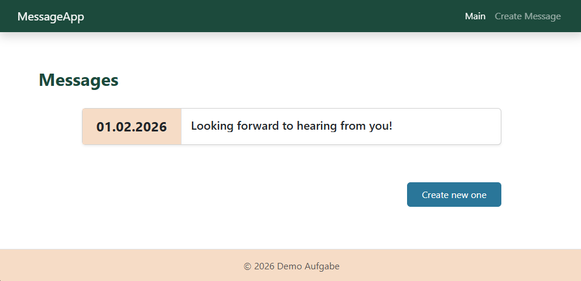

# A simple inbox application

# Task Description

Build a simple inbox application where users can create, view, and delete messages. The frontend should be in React, and the backend in Java.
For this exercise, there are no message recipients: all messages are visible to everyone, and each user can see and manage all messages. When a new message is created, it will appear in the list and that’s it.


## Technologies

- Java Spring Boot
- React
- Typescript
- PostgreSQL
- Docker

## Frameworks

- Bootstrap
- Formik

## Installation

Build the app with following command 
```
docker-compose up --build
```
or
```
docker-compose build --no-cache
docker-compose up -d
```


## Uninstallation

Uninstall the app with the command 
```
docker-compose down
```

## Run App

Below is a command for running the app 
```
docker-compose up
```

## Work with the app through a Browser

The URL for local testing is:
```
http://localhost
```

